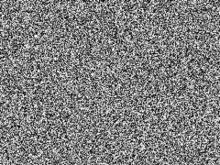
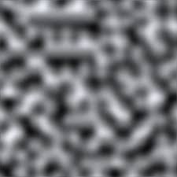

Many of us have played games that have an "infinite amount of worlds" or "procedurally generated terrain", but what does that mean? Surely someone didn't sit down and make the 18 quintillion (18,000,000,000,000,000,000) planets of no man's sky, so how does procedural generation work?

## the definition
There are many methods for implementing procedural generation, but they all fall under one general definition: **an algorithm with certain constraints tasked with the creation of content**. let's break down this definition:

- **an algorithm:** as described by the oxford dictionary "a process or set of rules to be followed in calculations or other problem-solving operations, especially by a computer". basically a program.
- **with certain constraints:** this algorithm needs to be given a set of rules that it will follow to give the result that we want. for example: "you can only put sand next to water" or "snow can only be on tall mountains".
- **tasked with the creation of content:** this algorithm in the end produces a planet to discover or an enemy fight or a thousand different pictures of monkeys to sell as NFTs.

## ain't that AI ?
No, it isn't. The way popular AI models work is by analyzing massive amounts of the content they should be producing, then try to create content which vaguely matches what they were trained on. 

Most of the effort that it would take to make an AI model is in gathering the data used to train it. While when programming a procedural generation engine, effort goes into tweaking the limitations manually to try to get it to do what you want.

The quality of an AI depends almost completely on the quality and quantity of its training data. Getting data is hard, especially if you want to make something in a specific style. So for a lone game developer, making a thousand worlds and then training an AI on them is more work than coding an algorithm from scratch.

## how it works in Minecraft
As stated before, there are many ways of implementing procedural generation, but the method I'm gonna be exploring to make terrain is one that is very commonly used (by Minecraft and other): **Perlin noise**.

### what is Perlin noise?
Have you ever opened up your TV while the signal was bad and saw something that looked like this...

This is called noise. it's made by giving each pixel (tiny square) in the image a number from 0 to 1. 0 is white. 1 is black. All the decimals in between are different shades of gray. However this is too messy to make a world out of, so in comes Ken Perlin with his famous algorithm that can generate so called _perlin noise:_

Here the shifts are gradual, and that's the key thing, because we are gonna use this image as a _height map!_

### height map???
The blacker a part of an image is (how high the number assigned is), the higher the elevation of that spot in our world. In other words: imagine each black spot as a tall mountain, and each white spot as a deep ocean.

### finally, we draw the world!
Now we have the noise map which tells us which places of our world are mountains, which are flat plains, and which are seas, let's make the world:

1. create a cube for each value in the noise map
2. set the height of the cube to match the value it maps to
3. change the color of the cube to match what it's supposed to be. ex: green for plains, white for the tops of mountains

*note: for oceans which correspond to very low values, having them drawn at the height they match will make it so there's a big hole, and then water at the very bottom... not what we want. Instead we will ignore the height value when drawing oceans, and instead draw them at the height of ground next to them.*

### the result 
Implementing the method i described above the result is this:

<iframe src="https://mohsen-procedural-gen.web.app/"></iframe>

You might have noticed that this is not a 3D rendering but a 2D map. The problem I faced when implementing 3D procedural generation was not the algorithm itself, but the platform it was running on.

As much as i love the web platform (as i explained in [this post](/posts/the-web-as-the-ultimate-app-platform/)), i do admit it has limitations, one of which is not being particularly powerful when it comes to high performance programs, like a mass 3D rendering of over a million cubes.

## conclusion
Procedural generation is quite famous among all game developers for a reason. It allows us to do more with less. While there are many  methods of procedural generation, one of the most common algorithms used for procedural terrain is perlin noise which i used by huge games like Minecraft.

---

## scources

- [Making the World Infinite for my Top Down Pixel game](https://youtu.be/gu4xOWIFQUA), by Aeroblizz.
- [Procedural Landmass Generation (E01: Introduction)](https://youtu.be/wbpMiKiSKm8), by Sebastian Lague.

